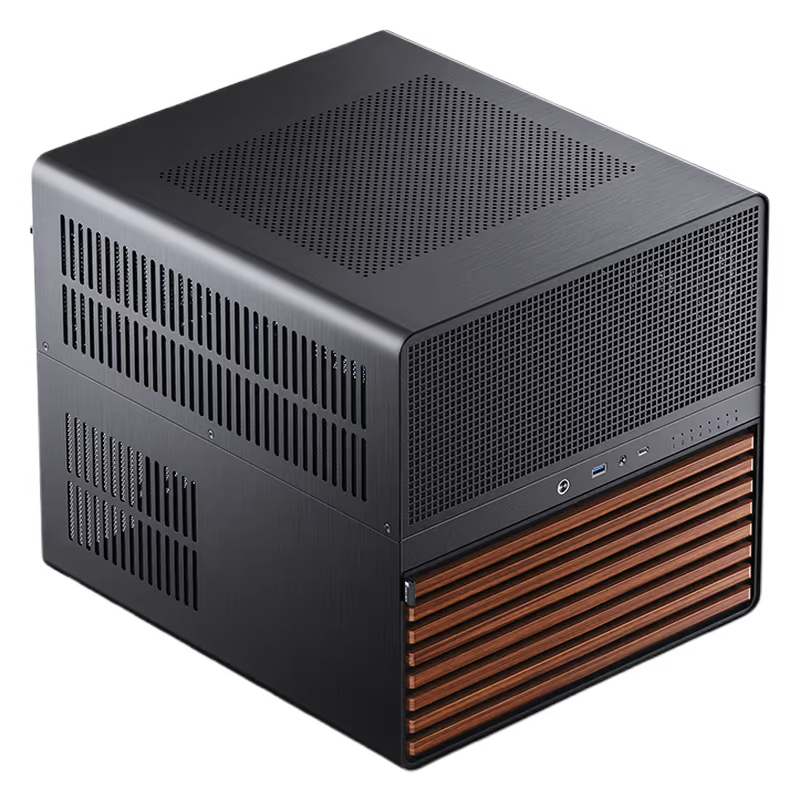

# Overview

This repository contains a complete NixOS system configuration using flakes, designed for running self-hosted services and managing network infrastructure. The configuration is modular and organized for maintainability.

# Hosts

## homelab

### Services
- **Nextcloud** - Self-hosted file sync and collaboration platform
- **Vaultwarden** - Bitwarden-compatible password manager
- **Anytype** - Notion alternative
- **VPN** - WireGuard with split tunneling for own domains/censored domains
- **DNS** - dnsmasq DNS server for WireGuard split tunneling
- **Restic** - Automated backup solution
- **Nginx** - Reverse proxy
