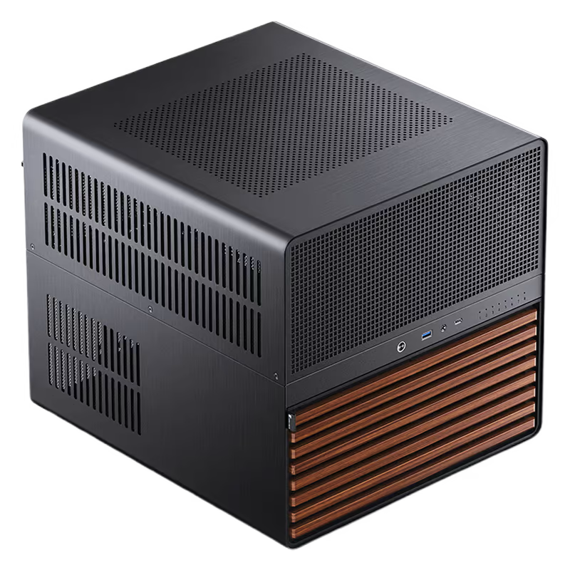
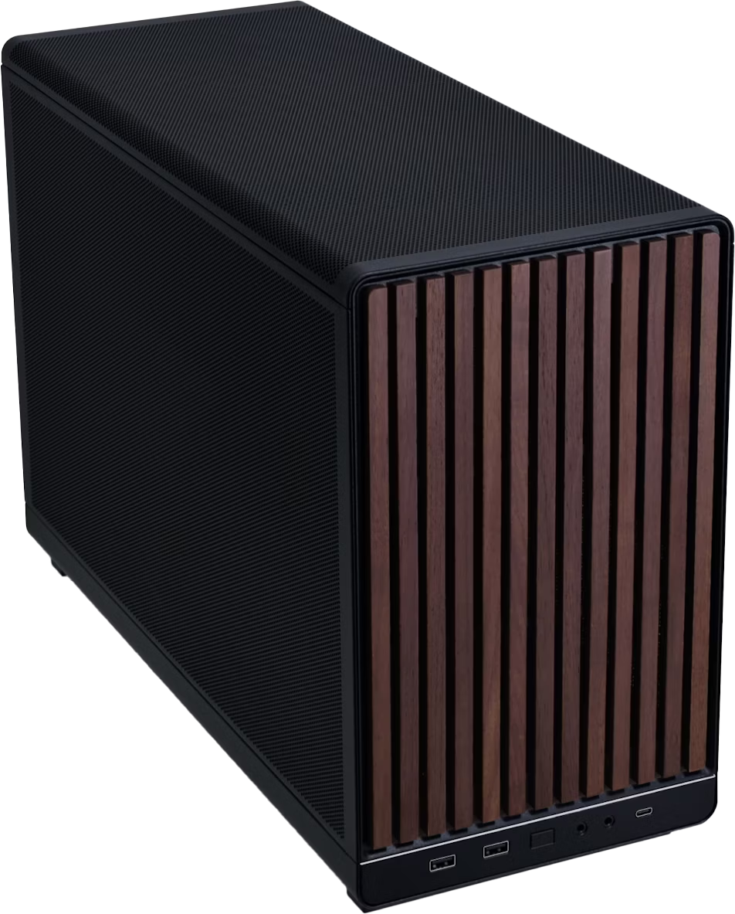

<div align="center"></div>

# Overview

This repository contains a complete NixOS system configuration using flakes, designed for running self-hosted services and managing network infrastructure. The configuration is modular and organized for maintainability.

# Hosts

## homelab

<div align="center"></div>

### Hardware
- Ryzen 9 5950x
- B550 Aorus Elite V2
- 48GB RAM
- 1TB SSD
- Intel Arc A380
- Sipeed NanoKVM PCIe
- Jonsbo N5 Case

### Services
- **Nextcloud** - Self-hosted file sync and collaboration platform
- **Vaultwarden** - Bitwarden-compatible password manager
- **VPN** - WireGuard with split tunneling for own domains/censored domains
- **DNS** - dnsmasq DNS server for WireGuard split tunneling
- **Sing-box** - Hysteria2 proxy for censored domains
- **Restic** - Automated backup solution
- **Nginx** - Reverse proxy

## Steam Machine

<div align="center"></div>

### Hardware
- Ryzen 5 7500f
- MSI PRO B650M-B
- 32GB RAM
- 2TB SSD
- Radeon RX9070XT
- Lian Li A3 Case

## Installation

Disk partitioning (example for steam machine):
```bash
sudo nix --extra-experimental-features "nix-command flakes" run github:nix-community/disko -- --mode zap_create_mount hosts/steam/disko.nix
```

Add personal ssh keys for secrets:
```bash
cp {ssh-key-name} /root/.ssh/{ssh-key-name}
sudo chmod 500 /root/.ssh/{ssh-key-name}
```

Installing the system:
```bash
sudo nixos-install --flake .#steam
```
